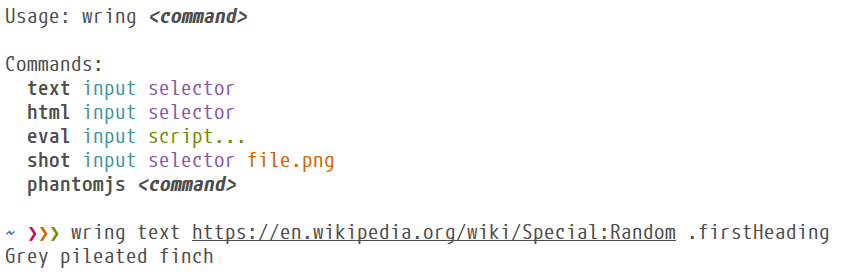

#  wring

## Installation
You can install wring using [npm](https://www.npmjs.com/package/wring/tutorial):

```sh
$ npm install --global wring
```

Wring utilizes [PhantomJS](http://phantomjs.org/) for some of its commands. To
use these, install it using your system package manager by running something
like `brew install phantomjs` on OS X, or `apt-get install phantomjs` on Ubuntu. You can
make sure it's on your `PATH` by running `phantomjs -v`.

Alternatively, you can install a version which automatically downloads PhantomJS
binaries for your system:

```sh
$ npm install --global wring-with-phantomjs
```

## Usage

#### `wring text`

Here is a simple example which prints contents of the matching element (uses
[Cheerio](https://github.com/cheeriojs/cheerio) under the hood):

```sh
$ wring text 'https://www.google.com/finance/converter?a=1&from=EUR&to=USD' '#currency_converter_result'
1 EUR = 1.0940 USD

# You can use the first letter of command as a shortcut
$ wring t http://randomfunfacts.com i
No president of the United States was an only child.

```

You can also use jQuery specific selectors such as `:contains()`:

```sh
$ wring t 'https://en.wikipedia.org/wiki/List_of_songs_recorded_by_Taylor_Swift' 'tr:contains("The Hunger Games") th:first-child'
"Eyes Open"
"Safe & Sound"
```

####  `wring html`

Prints `outerHTML`of matching elements. Here is an example, this time using an
XPath expression:

```sh
$ wring html "http://news.ycombinator.com" "//td[@class='title']/a[starts-with(@href,'http')]"
<a href="http://eftimov.net/postgresql-indexes-first-principles">PostgreSQL Indexes: First principles</a>
<a href="http://inference-review.com/article/doing-mathematics-differently">Doing Mathematics Differently</a>
<a href="https://blog.chartmogul.com/api-based-saas/">The rise of the API-based SaaS</a>
<a href="https://github.com/tallesl/Rich-Hickey-fanclub">Rich Hickey Fanclub</a>
...
```

####  Accepted inputs

First argument of a command specifies its input, which can be a URL, path to a
file, HTML string, or `-` to read the page source from `stdin`:

```sh
# read from file
$ curl 'http://www.purescript.org/' > page.html
$ wring t page.html '.intro h2'
PureScript is a small strongly typed programming language that compiles to JavaScript.

# read from string
$ wring text '<div class="foo">Hello</div>' '.foo'
Hello

# read from stdin
$ curl -s 'http://www.merriam-webster.com/word-of-the-day' | wring text - '.word-and-pronunciation h1'
keelhaul
```

#### Using with PhantomJS

Prefixing a command with `phantomjs` or `p` will run it using jQuery inside a
real web browser context. You can use this if you are having compatibility
problems with the commands above, but the real utility comes from being able to
scrape dynamically generated content:

```sh
$ wring p t '<title>Foo</title> <script>document.title = "Bar";</script>' 'title'
Bar

# compare it to the non-phantomjs invocation below
$ wring t '<title>Foo</title> <script>document.title = "Bar";</script>' 'title'
Foo

```
#### `wring eval`

Lets you evaluate JavaScript inside any page. Calling `wring('str')` will write
to terminal. You can pass any number of .js file paths, URLs, and JS expressions
as script arguments and they will get executed in given order:

```sh
$ wring eval 'http://ipfs.io' 'wring(document.title)'
IPFS is a new peer-to-peer hypermedia protocol.

# you can load and use third party libraries:
$ wring e 'http://ipfs.io' 'http://cdn.jsdelivr.net/lodash/4.5.1/lodash.js' 'wring(_.kebabCase(document.title))'
ipfs-is-a-new-peer-to-peer-hypermedia-protocol
```

#### Self contained scripts

You can also use a trick to make self contained scripts.

Here is a contrived example which loads Hacker News homepage, loads lodash,
sorts posts by their score, and prints the top 5:

```js
#!/bin/sh
":" //; exec wring eval "https://news.ycombinator.com" "https://cdn.jsdelivr.net/lodash/4.5.1/lodash.js" "$0"

var posts = _.map(
  document.querySelectorAll(".votelinks + .title > a"),
  function(el) {
    return el.textContent + "\n" + el.href;
  })

var scores = _.map(
  document.querySelectorAll(".score"),
  function (el) {
    return parseInt(el.textContent, 10);
  })

_(posts)
  .zipWith(scores, function (text, score) {
    return { text: text, score: score };
  })
  .orderBy("score", "desc")
  .take(5)
  .forEach(function (item) {
    wring(item.text + "\n");
  })
```

```sh
# after saving the source above to `wring_hn.js` you can run it like this
$ chmod +x wring_hn.js
$ ./wring_hn.js
Raspberry Pi 3 Model B confirmed, with onboard BT LE and WiFi
https://apps.fcc.gov/oetcf/eas/reports/...

After fifteen years of downtime, the MetaFilter gopher server is back
http://metatalk.metafilter.com/24019/...
...
```

#### `wring shot`

Last command to cover is `wring shot`, which renders a screenshot of first
matching element and saves it to a file:

```sh
$ wring shot 'https://www.google.com/finance?q=GOOG' '#price-panel' goog.png
wring: Saved to goog.png
```
Resulting `goog.png` will contain something like this:


## Development
```sh
# Install Node.js dependencies:
$ npm install

# Install PureScript dependencies:
$ bower install

# Build `wring.js` and `phantom-main.js`:
$ npm run build

# Run tests:
$ npm test

# Compile & run using Pulp (https://github.com/bodil/pulp):
$ pulp run text '<b>foo</b>' 'b'
```

## License

[MIT](https://github.com/osener/wring/blob/master/LICENSE)
